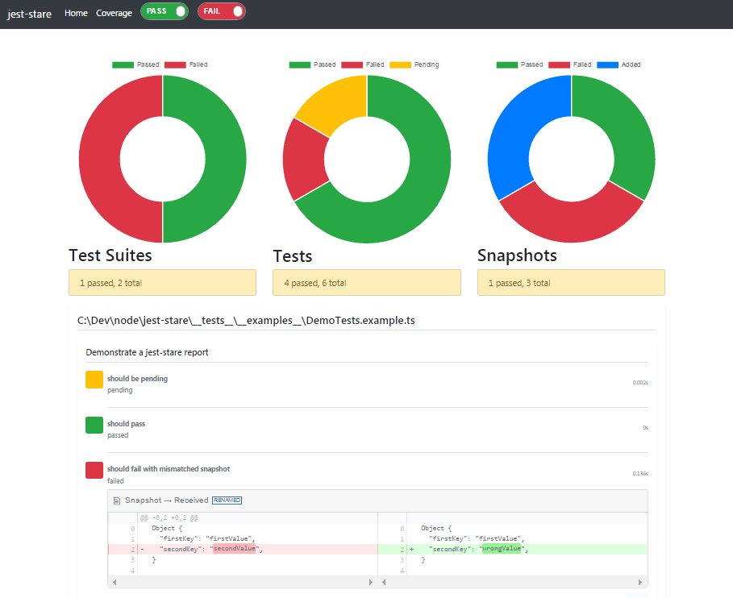

[](https://github.com/facebook/jest) 
[](https://circleci.com/gh/dkelosky/jest-stare)
[](https://travis-ci.com/dkelosky/jest-stare)
[](https://dev.azure.com/dkelosky/dkelosky/_build/latest?definitionId=1&branchName=master)
[](https://codecov.io/gh/dkelosky/jest-stare/)
[](https://badge.fury.io/js/jest-stare)
[](https://opensource.org/licenses/MIT)

# Jest HTML Reporter
This is a Jest HTML reporter.  It takes summary test results from jest
and parses them into an HTML file for improved readability and filtering.



## Features
* filter on pass / failed tests
* side-by-side snapshot diff
* chart-summarized information
* captures raw jest results JSON file
* link to generated coverage report (if configured)
* [configuration](#config)
* [cli](#cli)
* [api](#api)

## Usage
Run tests or a test with jest and specify `jest-stare` on the `--reporters` option:

* `jest --reporters default jest-stare`
* `jest --testResultsProcessor=jest-stare`

Alternatively, in your `jest` config within `package.json` set `reporters` to `jest-stare` :

* `"reporters: ["default", "jest-stare"]`
* `"testResultsProcessor": "./node_modules/jest-stare"`

`jest-stare` when used as a reporter updates the HTML report on each completed test run.  You can use this to view test output
that is incomplete (before each test suite completes).  Refresh your browser to see new tests as each suite completes.

By default, after a report is generated, output will go to `./jest-stare` and will contain:
* `index.html` - html report
* `jest-results.json` - raw jest json data
* `/js` - javascript render files
* `/css` - css stylings

### Config 
If you need to configure `jest-stare`, do so by adding a `jest-stare` object to your package.json, for example:
```typescript
jest-stare: {
    ...
}
```

You can also configure each option via environmental variables instead. Environmental variables take precedence over values in package.json. CLI options take precedence of environmental variables and configuration.

Within the configuration object you can specify the following fields:

Field | Environmental Variable | Default | Description | Example
--- | --- | --- | --- | ---
`resultDir` | `JEST_STARE_RESULT_DIR` | `jest-stare` | set the results directory | `"resultDir": "results/jest-stare"`
`resultJson` |  `JEST_STARE_RESULT_JSON` | `jest-results.json` | indicate the raw JSON results file name | `"resultJson": "data.json"`
`resultHtml` |  `JEST_STARE_RESULT_HTML` | `index.html` | indicate the main html file name | `"resultHtml": "main.html"`
`log` |  `JEST_STARE_LOG` | `true` | specify whether or not jest-stare should log to the console | `"log": "false"`
`jestStareConfigJson` |  `JEST_STARE_CONFIG_JSON` |  `undefined` | request to save jest-stare config raw JSON results in the file name | `"jestStareConfigJson": "jest-stare-config.json"`
`jestGlobalConfigJson` |  `JEST_STARE_GLOBAL_CONFIG_JSON` |  `undefined` | request to save global config results in the file name | `"jestGlobalConfigJson": "global-config.json"`
`report` |  `JEST_STARE_REPORT` |  `undefined` | boolean, set to false to suppress creating a HTML report (JSON only retained) | `"report": false`
`additionalResultsProcessors` |  `JEST_STARE_ADDITIONAL_RESULTS_PROCESSORS` | `undefined` | add additional test result processors to produce multiple report |`"additionalResultsProcessors": ["jest-html-reporter", "jest-junit"]`
`coverageLink` |  `JEST_STARE_COVERAGE_LINK` | `undefined` | link to coverage report if available | `"coverageLink": "../../coverage/lcov-report/index.html"`
`disableCharts` |  `JEST_STARE_DISABLE_CHARTS` | `undefined` | hide the doughnut charts in the HTML report | `"disableCharts": true`

### API
You can programmatically invoke jest-stare and provide jest response data via:
```typescript
// require jest-stare
const processor = require("jest-stare");

// load some jest results JSON data
const simplePassingTests = require("../__tests__/__resources__/simplePassingTests.json");

// call jest-stare processor, passing a first parm of the jest json results,
// and optionally a second parm of jest-stare config
processor(simplePassingTests, {log: false, resultDir: __dirname + "/output"});
```

### CLI
Use the `jest-stare` CLI to create or recreate an HTML report.  You only need to supply an input JSON
file containing the jest test results.  

You can invoke `jest-stare` as a CLI after installing globally via `npm install -g jest-stare`.  
Or if jest-stare is a local dependency you can invoke the CLI via `npx jest-stare...`

Assuming that you have a relative file to your current location in a folder "data" and 
"simplePassingTests.json" contains saved JSON output from a jest test invocation, you can
run the CLI providing a single positional input jest JSON file:
```
jest-stare data/simplePassingTests.json
```

Optionally you can control where the report will be stored using a second positional:
```
jest-stare data/simplePassingTests.json c:/users/myId/desktop/output
```

The command response takes a form of:
```
jest-stare was called with programmatic config
**  jest-stare: wrote output report to c:/users/myId/desktop/output/index.html  **
```

### Jest Watch
Because jest-stare writes *.js files when generating a report, you may get an infinite loop when using
`jest-stare` and `jest --watch`.  Samples of the problem are documented here:
* https://github.com/facebook/jest/issues/3923
* https://github.com/facebook/jest/issues/2516

To get around this problem, consider excluding `jest-stare` *.js files from watch via something like this:
```json
    "watchPathIgnorePatterns": [
      ".*jest-stare.*\\.js"
    ],
```

## Contributing

See [contributing](/CONTRIBUTING.md).

## Acknowledgements
Thanks to [dogboydog](https://github.com/dogboydog) for additions to configuration!

This project is based on:
* [jQuery](https://jquery.com/)
* [Bootstrap](https://getbootstrap.com/)
* [Holder.js](http://holderjs.com/)
* [Chart.js](http://www.chartjs.org/)
* [diff2html](https://diff2html.xyz/)
